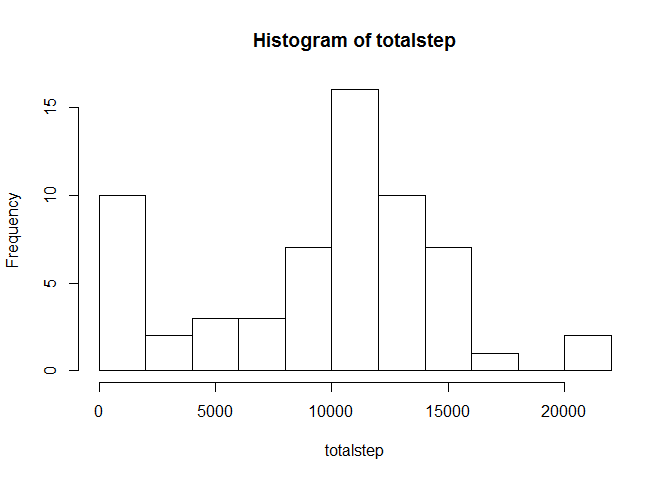
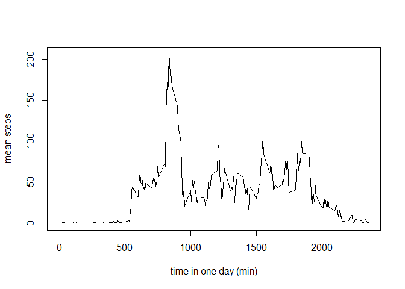
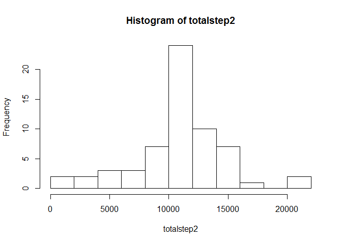

# Reproducible Research: Peer Assessment 1


## Loading and preprocessing the data

Loading the data form the csv file, then transform the date column to standard time format in R

```r
data<-read.csv("activity.csv",header=TRUE)
data$date<-as.Date(as.character(data$date),"%Y-%m-%d")
```


## What is mean total number of steps taken per day?

Caculate the total number per day, draw the histgram and calulate its mean and median


```r
totalstep<-sapply(split(data$steps,data$date),sum,na.rm=TRUE)
hist(totalstep,15)
```

 

```r
mean(totalstep,na.rm=TRUE)
```

```
## [1] 9354.23
```

```r
median(totalstep, na.rm=TRUE)
```

```
## [1] 10395
```
Mean total step across all days is 9354.23 while the median is 10395

## What is the average daily activity pattern?

Calculate the mean of each interval acorss all days and draw a time series plot then find the interval have largest mean steps


```r
factor<-as.factor(data$interval)
intervalmean<-sapply(split(data$steps,factor),mean,na.rm=TRUE)
plot(names(intervalmean),intervalmean,type="l", xlab="time in one day (min)",ylab="mean steps")
```

 

```r
names(which.max(intervalmean))
```

```
## [1] "835"
```
The interval have most steps is "835".

## Imputing missing values

We caculate the total number of rows containing NA, there are 2304 rows. Then we replace all these NAs by the mean steps in the corresponding interval across all days and creat a new dataset with these filling in data.


```r
anyna<-apply(data,1,function(x)any(is.na(x)))
sum(anyna)
```

```
## [1] 2304
```

```r
steps<-vector(length=17568)
for(i in 1:17568){
  if(is.na(data$steps[i])){
    steps[i]<-intervalmean[as.character(data$interval[i])]
  }
  else steps[i]<-data$steps[i]
}
data2<-data.frame(steps=steps,date=data$date,interval=data$interval)
```
We caclulate the totalsteps on the new set, draw the histgram and caculate the mean and median


```r
totalstep2<-sapply(split(data2$steps,data2$date),sum,na.rm=TRUE)
hist(totalstep2,15)
```

 

```r
mean(totalstep2,na.rm=TRUE)
```

```
## [1] 10766.19
```

```r
median(totalstep2, na.rm=TRUE)
```

```
## [1] 10766.19
```
The mean and median are the same for the new set (10766.19). Thus, through filling in NA points, we smooth the distribution of total steps in one day.

## Are there differences in activity patterns between weekdays and weekends?


```r
wk<-weekdays(data2$date)
fac<-as.factor(c("weekday","weekend"))
for(i in 1:17568){
if(wk[i] %in% c("lundi","mardi","mercredi","jeudi","vendredi")) data2$fac[i]<-fac[1]
   else data2$fac[i]<-fac[2]
}
```
